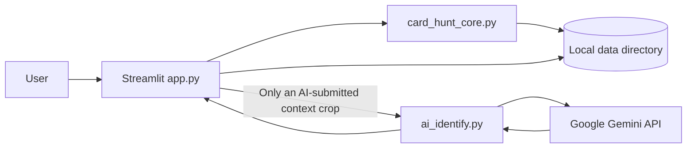

# Architecture

## System boundary

Card Hunt Local is a local Streamlit application with one optional external
integration: Google Gemini. Application state lives in the active Streamlit
session until the user explicitly saves a hunt or purchase data.



## Components

| Component | Responsibility |
| --- | --- |
| `app.py` | Streamlit layout, session orchestration, user actions, error presentation, audit calls, and exports. |
| `card_hunt_core.py` | Crop detection, crop persistence, candidate schema/dtypes, scoring, eligibility filters, ledger I/O, IDs, and audit append. |
| `ai_identify.py` | Gemini client boundary, conservative prompt, JSON schema, response normalization, usage metadata, retry classification, and fallback. |
| `migrate_v1.py` | Additive copy of v1 `data/` content; existing destination files are skipped. |
| `tests/test_core.py` | Provider-independent state, dtype, scoring, and confidence-gate regression tests. |
| `test_gemini.py` | Mocked Gemini parsing, retry, fallback, non-transient error, and state-preservation tests. |

## Runtime flow

### 1. Intake and session identity

1. The file uploader reads screenshot bytes.
2. `make_upload_fingerprint` calculates a deterministic SHA-1 fingerprint.
3. A new hunt `session_id` is created only when that fingerprint differs from
   `st.session_state["upload_fingerprint"]`.
4. Ordinary Streamlit reruns preserve the session ID, boxes, crop paths,
   context paths, candidates, AI usage, and per-crop errors.
5. A genuinely different upload resets screenshot-specific session state.

The session ID combines its creation timestamp with a short content hash. The
full upload fingerprint is session state, not a persisted identity registry.

### 2. Detection and crops

`detect_cards` uses OpenCV grayscale conversion, blur, Canny edges, dilation,
contours, size/aspect filters, and overlap suppression. Detection is local and
returns at most 50 ordered boxes.

`save_crops` writes two images per detected card beneath the current hunt's crop
directory:

- a tight card crop for display;
- a padded context crop with extra space, especially below the card, to retain
  price and request labels.

Manual cropping is available when detection misses or misframes a card.

### 3. Gemini identification

An AI action passes one local context crop to `identify_card`. The provider path
is:

```text
app.py
  → identify_crop_with_feedback(...)
  → ai_identify.identify_card(...)
  → genai.Client(api_key=GEMINI_API_KEY)
  → client.models.generate_content(
        model=...,
        contents=[instruction, image Part],
        config=GenerateContentConfig(
            system_instruction=...,
            response_mime_type="application/json",
            response_json_schema=IDENTIFICATION_SCHEMA,
        ),
    )
```

The required structured response contains:

```text
card_name, card_number, set_or_promo, year, language, variant,
raw_or_slab, grade, store_price_jpy, req_count, status_hint,
id_confidence, price_confidence, req_confidence, needs_review,
review_reason, possible_matches, visible_evidence
```

The prompt explicitly excludes market valuation and purchase advice. Exact
print evidence is more important than species recognition.

### 4. Retry and failure isolation

Only Gemini `503` / `UNAVAILABLE` failures are transient. The primary model gets
up to four total attempts: immediate, then approximately 2, 5, and 10 seconds,
each with small random jitter. The same in-memory contents and schema config are
reused across attempts.

After all primary attempts fail, the configured fallback is tried once. Invalid
requests, authentication/permission failures, schema errors, and programming
errors are not retried. Errors are attached to the affected crop; the existing
candidate row and other session state are retained so the user can retry it.

### 5. Candidate normalization and review

`apply_ai_result` updates a normalized copy and returns it only after successful
assignment and dtype normalization. Important dtype rules are:

- `year` and `price_jpy`: nullable `Int64`;
- `req_count`: non-null `Int64`, defaulting to zero;
- confidence and Hunt Score fields: nullable `Float64`;
- `card_number` and `grade`: strings/objects so formatting and labels survive.

`possible_matches` is flattened for table display. AI may auto-verify only an
unambiguous result with a visible card number and exact-ID confidence of at
least 0.96. All other difficult identities remain available for manual review.

### 6. Scoring, ranking, and purchases

The Hunt Score is a 0–100 weighted normalization of seven user-entered factors:

| Factor | Weight |
| --- | ---: |
| Value | 25 |
| Demand | 20 |
| Liquidity | 20 |
| Scarcity | 15 |
| History | 10 |
| Artwork | 5 |
| Condition | 5 |

Active Ranking applies the product eligibility rules documented in
[PRODUCT.md](PRODUCT.md). The purchase action repeats the identity gate before
appending a ledger row, so the ranking display is not the only enforcement
point.

## State and persistence

| Location | Lifetime | Contents |
| --- | --- | --- |
| `st.session_state` | Current Streamlit session | Upload fingerprint, session ID, boxes, paths, candidate DataFrame, AI usage, and crop errors. |
| `data/crops/<session_id>/` | Persistent local files | Tight and padded context crops. |
| `data/hunts/<session_id>.csv` | Persistent on explicit save | Candidate worksheet snapshot. |
| `data/ledger.csv` | Persistent on purchase/ledger save | Inventory and acquisition fields. |
| `data/audit.jsonl` | Append-only application log | AI result/error/retry/fallback events, saved hunts, and purchases. |

The entire `data/` directory is ignored by Git and must be treated as
user-owned. Backups are the user's responsibility in v2.

## Audit and sensitive data

AI events record `provider="gemini"`, model, session/crop context, and the event
payload appropriate to the action. Retry reasons and displayed AI errors redact
the current API key if it appears in an exception. The API key itself must never
be written to the audit trail.

The audit log can contain identification results and local paths. It is local
operational data, not a sanitized artifact for publication.

## Configuration

| Variable | Purpose | Current default |
| --- | --- | --- |
| `GEMINI_API_KEY` | Enables AI identification and authenticates the Gemini client. | None; AI disabled when absent. |
| `CARD_HUNT_MODEL` | Primary identification model. | `gemini-3.8-flash` |
| `CARD_HUNT_FALLBACK_MODEL` | Model tried after primary transient retries. | `gemini-3.5-flash` |

`.env` and `.streamlit/secrets.toml` are ignored and must not be inspected,
documented verbatim, or committed.

## Known architectural constraints

- Streamlit reruns the script on every interaction, so stable session identity
  and explicit widget keys are correctness concerns.
- Session state is process/session scoped; unsaved worksheet edits are not a
  crash-recovery mechanism.
- CSV and JSONL persistence are simple and inspectable but do not provide
  transactions, concurrent-writer coordination, or schema migrations.
- Detection is heuristic and sensitive to screenshot layout and visual clutter.
- Gemini model availability, latency, quotas, and output quality are external
  dependencies when AI Identify is used.
